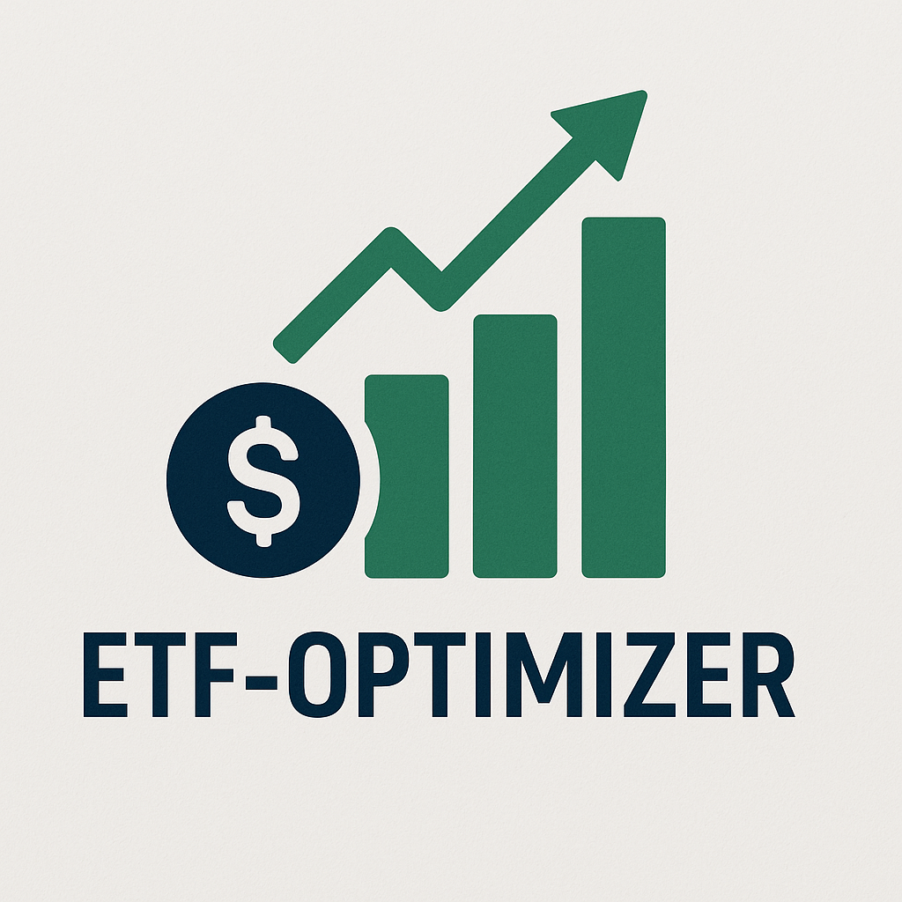
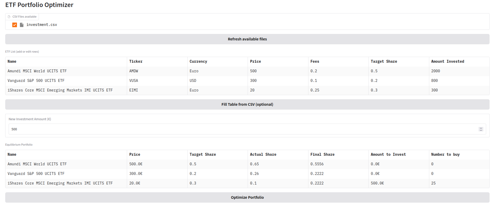

<p align="center">
  
</p>

# Portfolio-Balancer

Portfolio-Balancer is a Python module for optimizing and rebalancing investment portfolios comprising any securities, including Exchange-Traded Funds (ETFs). Given a set of securities and their target allocation weights, the module computes the optimal investment adjustments required to align the portfolio with the desired strategy.

## Key Features
- Mathematical Optimization: Uses Mixed-Integer Quadratic Programming (MIQP) to determine the most efficient asset allocation while respecting constraints (e.g., lot sizes, transaction costs).
- Solver Integration: Leverages [CVXPY](https://www.cvxpy.org/) for convex optimization modeling and [PySCIPOpt](https://github.com/scipopt/PySCIPOpt) as the underlying solver.
- Real-Time Data Fetching:
  - Security prices via [yfinance](https://github.com/ranaroussi/yfinance) (Yahoo Finance API).
  - Currency conversion via [forex-python](https://github.com/MicroPyramid/forex-python) for multi-currency portfolios.
- Export Compatibility: Generates output in a format compatible with Wealthfolio for seamless portfolio tracking.
- **Security Contract Comparator tool:** Simulate and compare the evolution of multiple securities investment contracts with customizable fees and taxes, and visualize results interactively.

## Use Case
Ideal for investors, financial advisors, and algorithmic traders seeking to:
✅ Automated Rebalancing – Maintains target asset allocations with minimal manual intervention, ensuring alignment with investment strategies.

✅ Multi-Currency Support – Dynamically adjusts for exchange rate fluctuations, enabling accurate valuation and rebalancing of global portfolios.

✅ User-Friendly GUI – Accelerates workflow with an intuitive interface, reducing complexity for faster decision-making and execution.

✅ Wealthfolio Integration – Exports optimized allocations in a compatible format for seamless tracking via [Wealthfolio](https://github.com/afadil/wealthfolio).


## Project Structure

- `main.py`: Example usage and entry point.
- `gradio-app.py`: Gradio interface.
- `PBalance/Security.py`: Defines the `Security` class for representing individual securities.
- `PBalance/Portfolio.py`: Defines the `Portfolio` class.
- `PBalance/Equilibrate.py`: Defines the `Equilibrate` class which contains the portfolio optimization algorithm.
- `Tools/Contract_security_comparator.py`: Interactive command-line tool to compare security investment contracts with fees and capital gains tax.
- `pyproject.toml`: Project metadata and dependencies.

## Installation

Clone the repository from Github
```
git clone git@github.com:PhDFlo/ETF-Optimizer.git
```

In the `Portfolio-Balancer` folder create the python environment using [uv](https://github.com/astral-sh/uv):
```
uv venv
source .venv/bin/activate
uv pip install -r requirements.txt
```

## Gradio interface Usage

To facilitate the use of the ETF-Optimizer tool a Gradio interface is available by running `python gradio-app.py`. The app will be running locally and should display something like:

```
* Running on local URL:  http://127.0.0.1:7860
* To create a public link, set `share=True` in `launch()`.
```

Open the url in any browser.

<p align="center">
  
</p>

- To create your ETF portfolio, add in the `Inputs` directory a .csv based on the `investment.csv` file.
- Refresh the list of available files by clicking on the `Refresh available files` button and select your file.
- Fill the table by clicking on the `Fill Table from CSV` button. This step is optionnal as you may want to fill the table directly on the web page.
- Select the investment amount you want to add to your portfolio and click on the `New Investment Amount (€)` button. Default is 500€.
- Choose the minimum amount to be invested, default is 99%. Ex: with an investment of 500€, at least 495€ will be placed in the portfolio.
- Finally, compute the optimization to get as close as possible to the target share. 

## Python Example Usage

```python
from DCA.ETF import ETF
from DCA.Portfolio import PortfolioETF

def main():
    # Create ETF instances
    security1 = Security(
        name="Amundi MSCI World UCITS Security",
        ticker="AMDW",
        currency="EUR",
        price_in_security_currency=500.0,
        yearly_charge=0.2,
        target_share=0.5,
        number_held=20.0,
    )
    security2 = Security(
        name="Vanguard S&P 500 UCITS Security",
        ticker="VUSA.AS",
        currency="USD",
        price_in_security_currency=300.0,
        yearly_charge=0.1,
        target_share=0.2,
        number_held=1.0,
    )
    security3 = Security(
        name="iShares Core MSCI Emerging Markets IMI UCITS Security",
        ticker="EIMI.L",
        currency="EUR",
        price_in_security_currency=200.0,
        yearly_charge=0.25,
        target_share=0.3,
        number_held=3.0,
    )

    # Create a Portfolio instance
    portfolio = Portfolio()
    portfolio.add_security(security1)
    portfolio.add_security(security2)
    portfolio.add_security(security3)

    portfolio.to_json("Portfolios/investment_example.json")

    portfolio.update_security_prices()  # Update prices from yfinance
    portfolio.compute_actual_shares()

    # Solve for equilibrium
    Equilibrate.solve_equilibrium(
        portfolio.securities, investment_amount=1000.0, min_percent_to_invest=0.99
    )

    # Log portfolio info
    info = portfolio.get_portfolio_info()
    logging.info("Portfolio info:")
    for security_info in info:
        logging.info(f"Security:")
        for k, v in security_info.items():
            logging.info(f"  {k}: {v}")

if __name__ == "__main__":
    main()
```

## Python Example Output
```
ETF 'Amundi MSCI World UCITS ETF' added to portfolio with share 0.5.
ETF 'Vanguard S&P 500 UCITS ETF' added to portfolio with share 0.2.
ETF 'iShares Core MSCI Emerging Markets IMI UCITS ETF' added to portfolio with share 0.3.

Verifying portfolio shares...
Portfolio shares sum equal to 1. Portfolio is complete.

Optimisation status: optimal

Number of each ETF to buy:
  Amundi MSCI World UCITS ETF: 0
  Vanguard S&P 500 UCITS ETF: 0
  iShares Core MSCI Emerging Markets IMI UCITS ETF: 5

Amount to spend and final share of each ETF:
  Amundi MSCI World UCITS ETF: 0.00€, Final share = 0.4878
  Vanguard S&P 500 UCITS ETF: 0.00€, Final share = 0.1951
  iShares Core MSCI Emerging Markets IMI UCITS ETF: 1000.00€, Final share = 0.3171

Total amount to invest: 1000.00€

Portfolio info:
ETF:
  name: Amundi MSCI World UCITS ETF
  ticker: AMDW
  currency: Euro
  price: 500.0€
  fees: 0.2
  target_share: 0.5
  amount_invested: 2000.0€
  actual_share: 0.65
  number_to_buy: 0
  amount_to_invest: 0.0€
  final_share: 0.4878
ETF:
  name: Vanguard S&P 500 UCITS ETF
  ticker: VUSA
  currency: USD
  price: 300.0€
  fees: 0.1
  target_share: 0.2
  amount_invested: 800.0€
  actual_share: 0.26
  number_to_buy: 0
  amount_to_invest: 0.0€
  final_share: 0.1951
ETF:
  name: iShares Core MSCI Emerging Markets IMI UCITS ETF
  ticker: EIMI
  currency: Euro
  price: 200.0€
  fees: 0.25
  target_share: 0.3
  amount_invested: 300.0€
  actual_share: 0.1
  number_to_buy: 5
  amount_to_invest: 1000.0€
  final_share: 0.3171
```

## Tools

### Security Contract Comparator Usage

The `Contract_security_comparator.py` script allows you to simulate and compare the evolution of multiple securities investment contracts, each with its own fees and capital gains tax. You can define any number of contracts directly from the command line. It provides quantitative information to choose the best contract for investing on a particular security.

**Example usage:**
```sh
python Contract_security_comparator.py --initial 20000 --annual-return 0.06 --years 25 --yearly_contribution 1000 \
  --contract "A,0.0059,0.006,0.172" \
  --contract "B,0.0012,0.00,0.30"
```
- `--contract "Label,Security_fee,Bank_fee,CapitalGainsTax"`: Add as many contracts as you want, each with its own parameters.
- All values for fees and taxes are expressed as decimals (e.g., 0.0059 for 0.59%).

The script will print the results for each contract and plot a graph comparing their evolution and final after-tax values.

## Requirements

- Python 3.12+
- numpy
- cvxpy
- pyscipopt
- gradio
- pandas
- matplotlib
- pyQt6
- yfinance
- forex-python


## License

MIT License