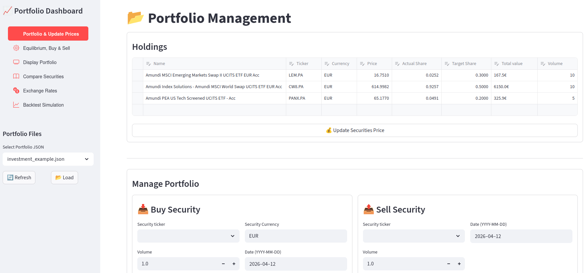
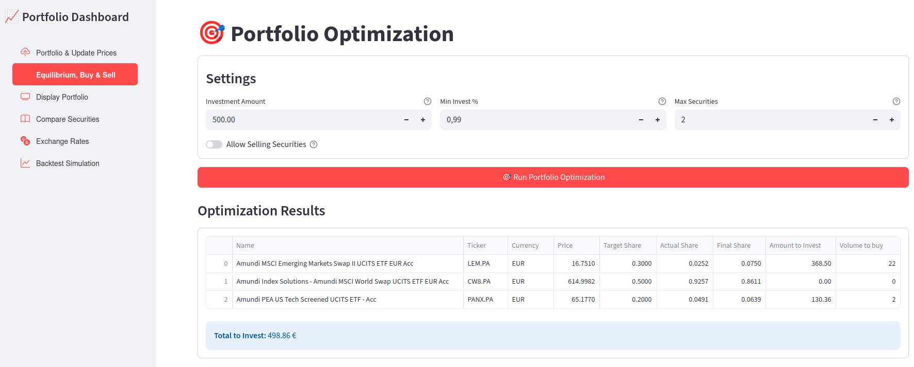
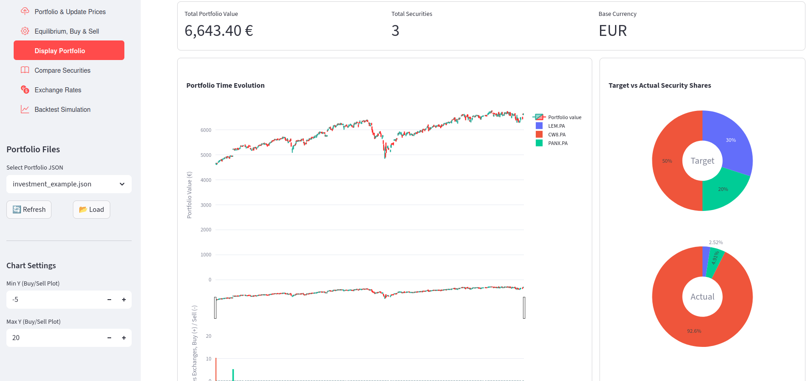

<p align="center">
  
</p>

[](https://github.com/PhDFlo/foliotrack/actions/workflows/python-package.yml)
[](https://pypi.org/project/foliotrack/)
[](https://pypi.org/project/foliotrack/)
[](https://pypi.org/project/foliotrack/)

# FolioTrack

**FolioTrack** is a robust, modular Python library for modern portfolio management. It helps you **manage**, **optimize**, **rebalance**, and **backtest** multi-currency investment portfolios with ease.

Designed primarily for **DIY passive investors**, FolioTrack automates the mathematical heavy lifting of maintaining a "lazy" portfolio. It ensures your asset allocation remains perfectly balanced with minimal effort, helping you stick to your long-term strategy without the spreadsheet headaches.

---

## 🚀 Why FolioTrack?

- **🧠 Smart Optimization**: Uses **Mixed-Integer Quadratic Programming (MIQP)** to calculate the best integer number of shares to buy/sell to reach your target allocation, respecting constraints like minimum order size or maximum number of positions to buy.
- **🌍 Multi-Currency Native**: Seamlessly handles portfolios with assets in different currencies (USD, EUR, GBP, etc.). Real-time exchange rates, taken from the European Central Bank (ECB) API, ensure your valuations are always accurate.
- **🏗️ Clean Architecture**: Built with Domain-Driven Design principles. Your core portfolio logic is decoupled from external data providers, making the system testable and extensible.
- **🔌 Pluggable Data**: Comes with support for [**yfinance**](https://github.com/ranaroussi/yfinance) and [**ffn**](https://github.com/pmorissette/ffn), but you can easily plug in your own market data provider.
- **📈 Built-in Backtesting**: Validate your strategies against historical data before investing a cent using [**bt**](https://github.com/pmorissette/bt).
- **📊 Interactive Dashboard**: A full-featured Streamlit web dashboard for visual portfolio management, optimization, and analysis.

## ✨ Features

- **Portfolio Management**
  - Track stocks, ETFs, and other securities.
  - JSON-based persistence for easy saving/loading.
  - Transaction history logging.

- **Advanced Rebalancing**
  - Set target weights (e.g., "60% Stocks, 40% Bonds").
  - Mathematical solver finds the optimal trades to minimize tracking error.
  - Cardinality constraints (limit number of positions).

- **Data Sources**
  - `yfinance` (Yahoo Finance) support out of the box.
  - `ffn` support for straightforward financial time series.
  - `bt`support for backtest simulations.
  - Extensible `MarketService` architecture.

- **Interactive Dashboard** _(optional)_
  - Load, save, and manage portfolios visually.
  - Update live security prices from the UI.
  - Run portfolio optimization and view recommended trades.
  - Display portfolio composition with pie charts and candlestick evolution.
  - Compare investment contracts (fees, taxes) with interactive simulations.
  - View ECB exchange rates with currency conversion.
  - Run backtests with equity curves, monthly return histograms, and per-security bar charts.

## 🛠️ Installation

```bash
# Using pip
pip install foliotrack

# Using uv
uv pip install foliotrack
```

### Installing the Dashboard

The dashboard has additional dependencies (Streamlit, Plotly) that are optional. Install them with:

```bash
# Using pip
pip install foliotrack[dashboard]

# Using uv (development)
uv pip install foliotrack[dashboard]
```

## ⚡ Quick Start

### 1. Python API

Open the `examples/portfolio_from_scratch.ipynb` in your favorite code editor to get an overview of the library features.
FolioTrack's modular API is intuitive. Here is a classic "60/40" portfolio example:

```python
from foliotrack.domain.Portfolio import Portfolio
from foliotrack.services.MarketService import MarketService
from foliotrack.services.OptimizationService import OptimizationService
from foliotrack.services.BacktestService import BacktestService
from foliotrack.storage.PortfolioRepository import PortfolioRepository

# 1. Setup Services
market_service = MarketService(provider="yfinance")
optimizer = OptimizationService()
repo = PortfolioRepository()

# 2. Create Portfolio
portfolio = Portfolio("Retirement Fund", currency="EUR")

# Buy classic ETFs (Stocks + Bonds)
portfolio.buy_security("IDDA.AS", volume=50.0) # iShares MSCI World (Stocks)
portfolio.buy_security("AGGH.AS", volume=50.0) # iShares Global Agg Bond (Bonds)

# 3. Enrich with Market Data
market_service.update_prices(portfolio)

# 4. Set Targets (60% Stocks, 40% Bonds) & Optimize
portfolio.set_target_share("IDDA.AS", 0.6)
portfolio.set_target_share("AGGH.AS", 0.4)

# Calculate optimal buys to invest an additional 5000 EUR
optimizer.solve_equilibrium(portfolio, investment_amount=5000.0)

# 5. Save Work
repo.save_to_json(portfolio, "my_portfolio.json")
```

### 2. Interactive Dashboard

Launch the full web dashboard with a single command:

```bash
dash
```

This starts a Streamlit application in your browser with the following pages:

| Page                          | Description                                                                            |
| ----------------------------- | -------------------------------------------------------------------------------------- |
| **Portfolio & Update Prices** | Load/save portfolio JSON files, view holdings, update live prices, buy/sell securities |
| **Equilibrium, Buy & Export** | Configure optimization parameters, run MIQP solver, view recommended trades            |
| **Display Portfolio**         | Visualize portfolio with candlestick charts, pie charts (target vs actual allocation)  |
| **Compare Securities**        | Compare investment contracts with different fees and tax regimes                       |
| **Exchange Rates**            | Look up ECB exchange rates and convert currencies                                      |
| **Backtest Simulation**       | Run historical backtests with equity curves, statistics, and return analysis           |

<p align="center">
  
  
  
</p>

## 🏛️ Architecture

FolioTrack follows a **clean, layered architecture**:

- **`domain/`**: Pure Python data entities (`Portfolio`, `Security`). No external dependencies or I/O here.
- **`services/`**: Business logic and external adapters.
  - `MarketService`: Fetches prices.
  - `OptimizationService`: Runs the solver.
  - `BacktestService`: Runs simulations.
- **`storage/`**: Handles file persistence (`PortfolioRepository`).
- **`dashboard/`**: Interactive Streamlit web application _(optional)_.
  - `app.py`: Main Streamlit entry point with sidebar navigation.
  - `pages/`: Individual dashboard pages (load, optimize, display, compare, exchange, backtest).
  - `utils/`: Dashboard-specific helpers (plots, formatting, file operations, simulation).
- **`examples/`**: Jupyter notebook examples files

This structure ensures that your portfolio data remains safe and stable, regardless of how market APIs or file formats change over time.

## 🤝 Contributing

Contributions are welcome! FolioTrack uses **[uv](https://github.com/astral-sh/uv)** for fast, reliable dependency management.

```bash
# Clone the repository
git clone git@github.com:PhDFlo/foliotrack.git
cd foliotrack

# Sync dependencies and create virtual env
uv sync

# Activate environment
source .venv/bin/activate
```

Please run the test suite (core + dashboard) before submitting a PR:

```bash
uv run pytest
```

Tests are organized as:

- `tests/foliotrack/` — Core library unit tests (portfolio, security, optimization, backtest, market, currency).
- `tests/dashboard/components/` — Dashboard utility tests (formatting, file helpers, simulation).
- `tests/dashboard/ui/` — Streamlit UI tests using `AppTest` harness (page loading, interactions).

## 📄 License

Apache License 2.0. See `LICENSE` for details.
